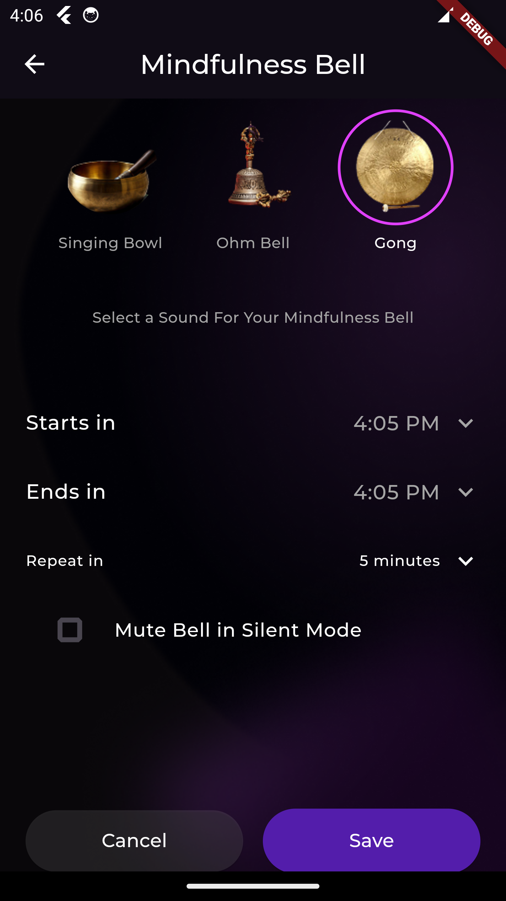

# Mindfulness Bell

A Flutter-based mindfulness app that plays meditation bell sounds (Singing Bowl, Ohm Bell, Gong) at scheduled intervals — even when the app is in the background or closed.

---

## Features

- Choose between 3 calming bell sounds
- Set start time, end time, and interval (5, 10, 15 mins)
- Works in background and when app is closed
- Option to mute bell in silent mode
- Beautiful UI with custom design and animations
- Built using Flutter + Riverpod + Local Notifications

---

## Setup

### Prerequisites

- Flutter 3.24.3+
- Dart SDK
- Android device (Android 12+ recommended)

---

### Packages Used

```yaml
flutter_local_notifications: ^17.0.0
timezone: ^0.9.2
flutter_riverpod: ^2.4.0
```

### Installation

- git clone https://github.com/your-username/mindfulness_bell.git
- cd mindfulness_bell
- flutter pub get
- flutter run

### How it Works

Uses flutter_local_notifications for both instant and scheduled alarms
Uses zonedSchedule() + timezone to support exact time scheduling
Loads .mp3 sound files from android/app/src/main/res/raw/
Integrates Riverpod for clean state management
Optional mute-in-silent toggle disables bell in system silent mode

### Screenshots


